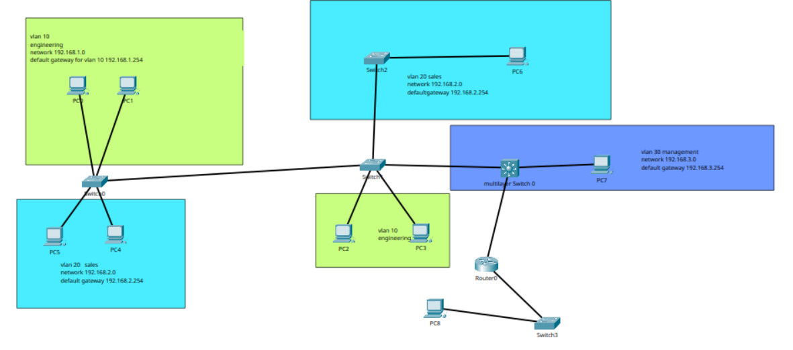
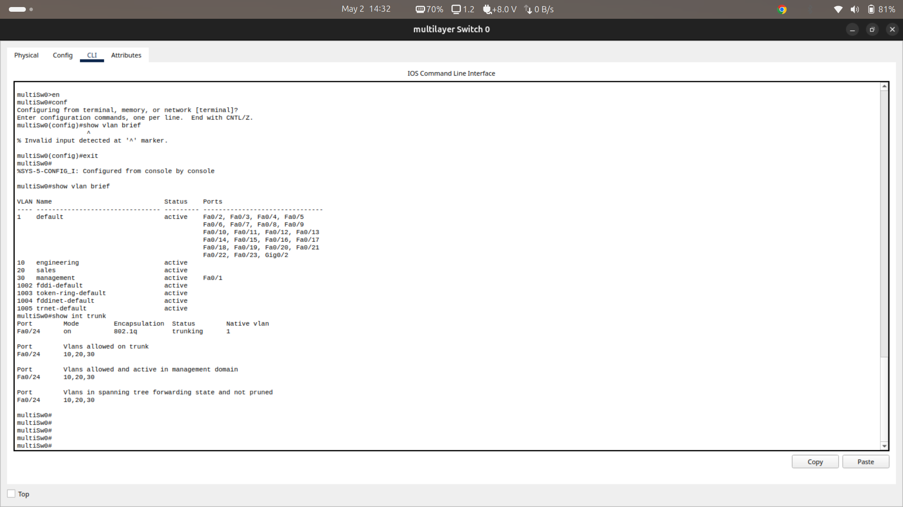

# CCNA VLAN Lab — Multi-Switch VLAN Segmentation with Inter-VLAN Routing and ACL Security

**Author:** Kamran Ali  
**Tool:** Cisco Packet Tracer  
**Repository:** ccna-vlan-lab  

---

## Objective

Design and implement a multi-switch network with VLAN segmentation, 802.1Q trunking, inter-VLAN routing using a Multilayer Switch, and Extended ACL-based traffic filtering to restrict Sales VLAN access to the Management VLAN.

---

## Network Topology



The topology consists of four switches (SW0, SW1, SW2, Multilayer Switch0) interconnected via 802.1Q trunk links, with end hosts distributed across three VLANs.

---

## VLAN Design

| VLAN ID | Name        | Network         | Default Gateway  |
|---------|-------------|-----------------|------------------|
| 10      | engineering | 192.168.1.0/24  | 192.168.1.254    |
| 20      | sales       | 192.168.2.0/24  | 192.168.2.254    |
| 30      | management  | 192.168.3.0/24  | 192.168.3.254    |

---

## IP Addressing Table

| Device          | Interface   | IP Address       | VLAN |
|-----------------|-------------|------------------|------|
| PC0             | Fa0         | 192.168.1.x/24   | 10   |
| PC1             | Fa0         | 192.168.1.x/24   | 10   |
| PC2             | Fa0         | 192.168.1.x/24   | 10   |
| PC3             | Fa0         | 192.168.1.x/24   | 10   |
| PC4             | Fa0         | 192.168.2.x/24   | 20   |
| PC5             | Fa0         | 192.168.2.x/24   | 20   |
| PC6             | Fa0         | 192.168.2.x/24   | 20   |
| PC7             | Fa0         | 192.168.3.x/24   | 30   |
| MultiSw0        | Vlan10      | 192.168.1.254/24 | 10   |
| MultiSw0        | Vlan20      | 192.168.2.254/24 | 20   |
| MultiSw0        | Vlan30      | 192.168.3.254/24 | 30   |
| MultiSw0        | Gig0/1      | 10.0.0.1/30      | —    |
| Router0         | Gig0/0/1    | 10.0.0.2/30      | —    |

---

## Skills Demonstrated

- VLAN creation and named configuration across multiple switches
- Access port assignment per VLAN
- 802.1Q trunk configuration with allowed VLAN pruning
- Inter-VLAN routing using Multilayer Switch SVIs (`ip routing`)
- Extended Named ACL implementation for traffic filtering
- ACL applied outbound on SVI to restrict Sales→Management traffic
- Static default route on Multilayer Switch toward Router0
- Verification using `show vlan brief`, `show interfaces trunk`, `show ip route`, `show access-lists`

---

## Key Configurations

### VLAN Creation (All Switches)
```
vlan 10
 name engineering
vlan 20
 name sales
vlan 30
 name management
```

### Access Port Assignment (Example — SW1)
```
interface FastEthernet0/1
 switchport mode access
 switchport access vlan 10
interface FastEthernet0/2
 switchport mode access
 switchport access vlan 10
```

### 802.1Q Trunk Configuration (Example — SW1)
```
interface FastEthernet0/24
 switchport trunk encapsulation dot1q
 switchport mode trunk
 switchport trunk allowed vlan 10,20,30

interface GigabitEthernet0/1
 switchport trunk allowed vlan 10,20,30
 switchport mode trunk

interface GigabitEthernet0/2
 switchport trunk allowed vlan 10,20,30
 switchport mode trunk
```

### Inter-VLAN Routing — Multilayer Switch SVIs
```
ip routing

interface Vlan10
 ip address 192.168.1.254 255.255.255.0

interface Vlan20
 ip address 192.168.2.254 255.255.255.0

interface Vlan30
 ip address 192.168.3.254 255.255.255.0
```

### Extended ACL — Block Sales from Accessing Management
```
ip access-list extended salesblock
 10 deny ip 192.168.2.0 0.0.0.255 192.168.3.0 0.0.0.255
 20 permit ip any any

interface Vlan30
 ip access-group salesblock out
```

### Default Route
```
ip route 0.0.0.0 0.0.0.0 10.0.0.2
```

---

## Verification

### show vlan brief — Multilayer Switch

 

### show interfaces trunk — SW1
```
Port      Mode  Encapsulation  Status    Native vlan
Fa0/24    on    802.1q         trunking  1
Gig0/1    on    802.1q         trunking  1
Gig0/2    on    802.1q         trunking  1

Port      Vlans allowed on trunk
Fa0/24    10,20,30
Gig0/1    10,20,30
Gig0/2    10,20,30
```

### show access-lists — Multilayer Switch
```
Extended IP access list salesblock
    10 deny ip 192.168.2.0 0.0.0.255 192.168.3.0 0.0.0.255
    20 permit ip any any
```

### show ip route — Multilayer Switch
```
C    192.168.1.0/24 is directly connected, Vlan10
C    192.168.2.0/24 is directly connected, Vlan20
C    192.168.3.0/24 is directly connected, Vlan30
S*   0.0.0.0/0 [1/0] via 10.0.0.2
```

---

## Test Results

| Test | Source | Destination | Expected | Result |
|------|--------|-------------|----------|--------|
| Engineering → Management | PC2 (192.168.1.x) | PC7 (192.168.3.x) | ✅ Success | ✅ Pass |
| Sales → Management | PC5 (192.168.2.x) | PC7 (192.168.3.x) | ❌ Blocked | ✅ Pass |
| Sales → Engineering | PC5 (192.168.2.x) | PC2 (192.168.1.x) | ✅ Success | ✅ Pass |

---

## Files in This Repository

| File | Description |
|------|-------------|
| `vlan-labs.pkt` | Cisco Packet Tracer lab file |
| `README.md` | Lab documentation |
| `screenshots/` | Verification output screenshots |

---

## How to Open

1. Install [Cisco Packet Tracer](https://www.netacad.com/courses/packet-tracer)
2. Clone this repository: `git clone https://github.com/kamranali1/ccna-vlan-lab`
3. Open `vlan-labs.pkt` in Packet Tracer
4. Explore the topology and CLI of each device
